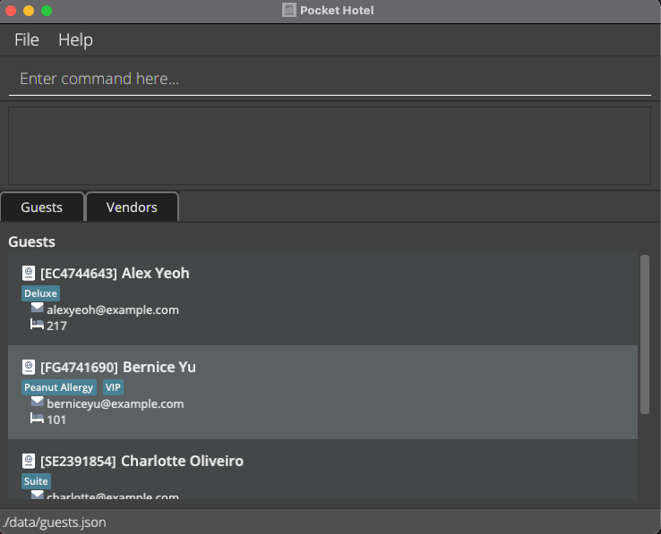

Pocket Hotel (PH) is a **desktop app for hotel front-desk receptionists that provides a centralized location to manage their guests and vendors, and helps to automate front-desk operations.**  It is optimized for use via a Command Line Interface (CLI) whilst still witholding some of the benefits of a Graphical User Interface (GUI).

For detailed **documentation**, please refer to the [PH Website](https://ay2122s1-cs2103t-w12-3.github.io/tp/)

_This project is based on the AddressBook-Level3 project created by the [SE-EDU initiative](https://se-education.org)._
