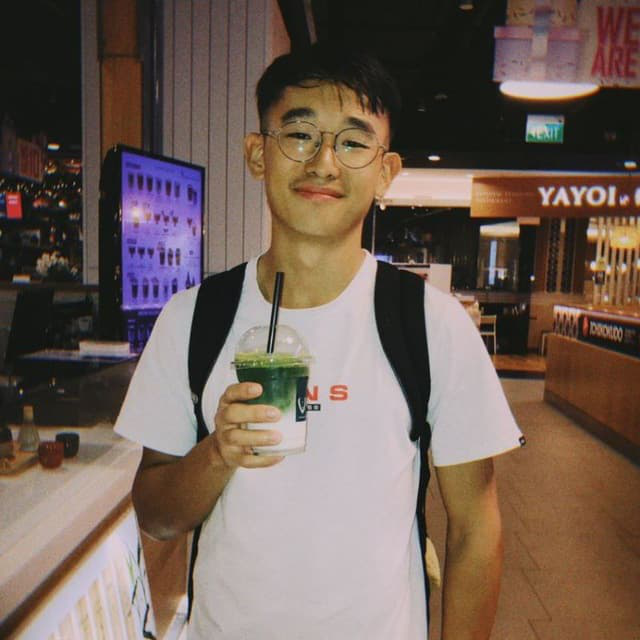
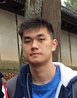
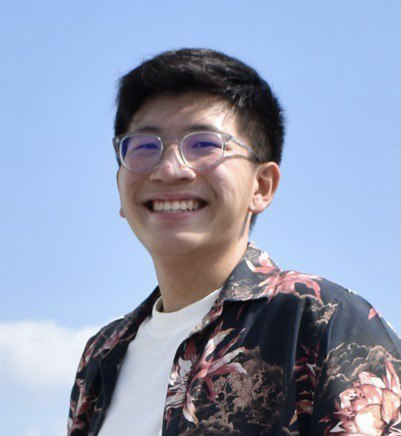

We are a team based in the [School of Computing, National University of Singapore](http://www.comp.nus.edu.sg).

You can reach us at the email `seer[at]comp.nus.edu.sg`

## Project team

### Alyssa Savier

[[github](https://github.com/alyssa-savier)]

* Role: 
* Responsibilities: 

### Jeremy Yeo Zhi Chen 

[[github](https://github.com/rgbpokka)]

* Role: 
* Responsibilities: 

### Calvin Tan 

[[github](https://github.com/calvintanwj)]
[[portfolio](team/calvintanwj.md)]

* Role:  
* Responsibilities: 

### Nicolas Chang

[[github](https://github.com/NicolasCwy)]
[[portfolio](team/nicolaschang.md)]

* Role:
* Responsibilities:

### Johnny Doe

[[github](http://github.com/johndoe)] [[portfolio](team/johndoe.md)]

* Role: Developer
* Responsibilities: Data

### Jean Doe

[[github](http://github.com/johndoe)]
[[portfolio](team/johndoe.md)]

* Role: Developer
* Responsibilities: Dev Ops + Threading

