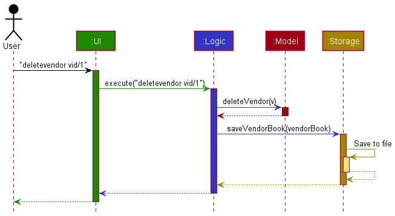
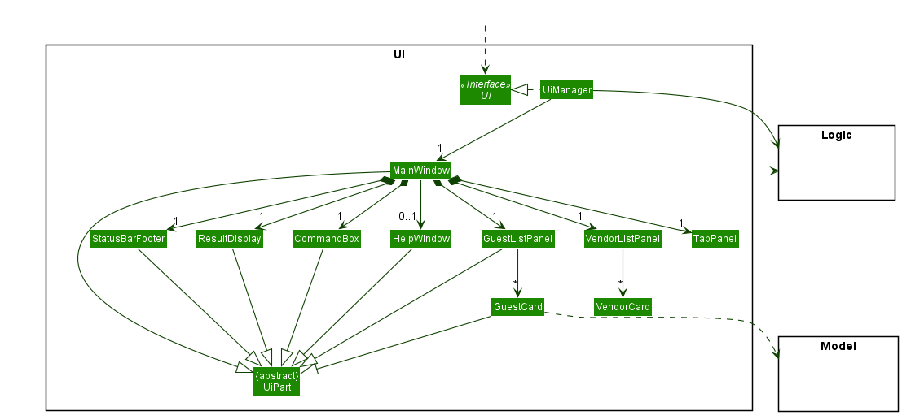
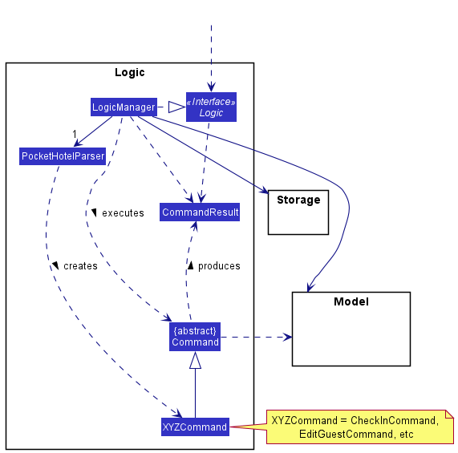
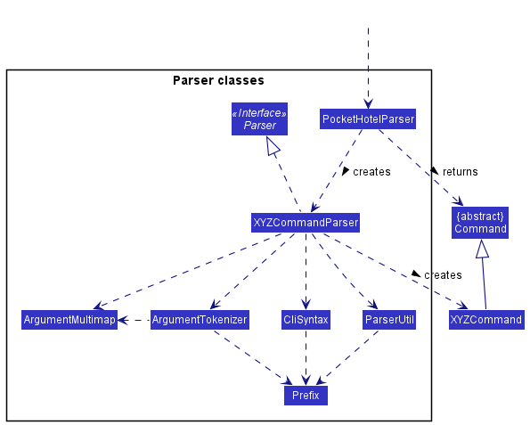
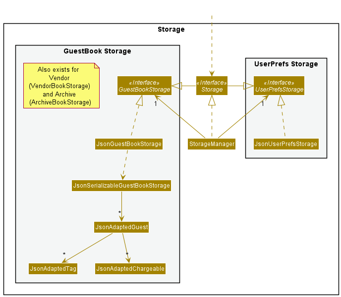

## **Table of Contents**

* Table of Contents
{:toc}

--------------------------------------------------------------------------------------------------------------------

## **Acknowledgements**

* {list here sources of all reused/adapted ideas, code, documentation, and third-party libraries -- include links to the
  original source as well}

--------------------------------------------------------------------------------------------------------------------

## **Setting up, getting started**

Refer to the guide [_Setting up and getting started_](SettingUp.md).

--------------------------------------------------------------------------------------------------------------------

## **Design**

:bulb: **Tip:** The `.puml` files used to create diagrams in this document can be found in
the [diagrams](https://github.com/se-edu/addressbook-level3/tree/master/docs/diagrams/) folder. Refer to the [_PlantUML
Tutorial_ at se-edu/guides](https://se-education.org/guides/tutorials/plantUml.html) to learn how to create and edit
diagrams.

### Architecture

The ***Architecture Diagram*** given above explains the high-level design of the App.

Given below is a quick overview of main components and how they interact with each other.

**Main components of the architecture**

**`Main`** has two classes
called [`Main`](https://github.com/se-edu/addressbook-level3/tree/master/src/main/java/seedu/address/Main.java)
and [`MainApp`](https://github.com/se-edu/addressbook-level3/tree/master/src/main/java/seedu/address/MainApp.java). It
is responsible for,

* At app launch: Initializes the components in the correct sequence, and connects them up with each other.
* At shut down: Shuts down the components and invokes cleanup methods where necessary.

[**`Commons`**](#common-classes) represents a collection of classes used by multiple other components.

The rest of the App consists of four components.

* [**`UI`**](#ui-component): The UI of the App.
* [**`Logic`**](#logic-component): The command executor.
* [**`Model`**](#model-component): Holds the data of the App in memory.
* [**`Storage`**](#storage-component): Reads data from, and writes data to, the hard disk.

**How the architecture components interact with each other**

The *Sequence Diagram* below shows how the components interact with each other for the scenario where the user issues
the command `delete vid/123`.

Each of the four main components (also shown in the diagram above),

* defines its *API* in an `interface` with the same name as the Component.
* implements its functionality using a concrete `{Component Name}Manager` class (which follows the corresponding
  API `interface` mentioned in the previous point.

For example, the `Logic` component defines its API in the `Logic.java` interface and implements its functionality using
the `LogicManager.java` class which follows the `Logic` interface. Other components interact with a given component
through its interface rather than the concrete class (reason: to prevent outside component's being coupled to the
implementation of a component), as illustrated in the (partial) class diagram below.

The sections below give more details of each component.

### UI component

The **API** of this component is specified
in [`Ui.java`](https://github.com/se-edu/addressbook-level3/tree/master/src/main/java/seedu/address/ui/Ui.java)

The UI consists of a `MainWindow` that is made up of parts e.g.`CommandBox`, `ResultDisplay`, `GuestListPanel`, `VendorListPanel`,
, `StatusBarFooter` etc. All these, including the `MainWindow`, inherit from the abstract `UiPart` class which captures
the commonalities between classes that represent parts of the visible GUI.

The `UI` component uses the JavaFx UI framework. The layout of these UI parts are defined in matching `.fxml` files that
are in the `src/main/resources/view` folder. For example, the layout of
the [`MainWindow`](https://github.com/se-edu/addressbook-level3/tree/master/src/main/java/seedu/address/ui/MainWindow.java)
is specified
in [`MainWindow.fxml`](https://github.com/se-edu/addressbook-level3/tree/master/src/main/resources/view/MainWindow.fxml)

The `UI` component,

* executes user commands using the `Logic` component.
* listens for changes to `Model` data so that the UI can be updated with the modified data.
* keeps a reference to the `Logic` component, because the `UI` relies on the `Logic` to execute commands.
* depends on some classes in the `Model` component, as it displays `Guest` and `Vendor` object residing in the `Model`.

### Logic component

**API** : [`Logic.java`](https://github.com/se-edu/addressbook-level3/tree/master/src/main/java/seedu/address/logic/Logic.java)

Here's a (partial) class diagram of the `Logic` component:

How the `Logic` component works:

1. When `Logic` is called upon to execute a command, it uses the `PocketHotelParser` class to parse the user command.
1. This results in a `Command` object (more precisely, an object of one of its subclasses e.g., `CheckInNewGuestCommand`) which is
   executed by the `LogicManager`.
1. The command can communicate with the `Model` when it is executed (e.g. to check in a guest).
1. The result of the command execution is encapsulated as a `CommandResult` object which is returned back from `Logic`.

The Sequence Diagram below illustrates the interactions within the `Logic` component for the `execute("deletevendor vid/123")` API
call.

:information_source: **Note:** The lifeline for `DeleteVendorCommandParser` should end at the destroy marker (X) but due to a limitation of PlantUML, the lifeline reaches the end of diagram.

Here are the other classes in `Logic` (omitted from the class diagram above) that are used for parsing a user command:

How the parsing works:

* When called upon to parse a user command, the `PocketHotelParser` class creates an `XYZCommandParser` (`XYZ` is a
  placeholder for the specific command name e.g., `CheckInNewGuestCommandParser`) which uses the other classes shown above to parse
  the user command and create a `XYZCommand` object (e.g., `CheckInNewGuestCommand`) which the `PocketHotelParser` returns back as
  a `Command` object.
* All `XYZCommandParser` classes (e.g., `CheckInNewGuestCommandParser`, `DeleteVendorCommandParser`, ...) inherit from the `Parser`
  interface so that they can be treated similarly where possible e.g, during testing.

### Model component

**API** : [`Model.java`](https://github.com/se-edu/addressbook-level3/tree/master/src/main/java/seedu/address/model/Model.java)

The `Model` component,

* stores the vendorbook and guestbook data i.e., all `Vendor` and `Guest` objects.
* stores the currently 'selected' `Guest` or `Vendor` objects (e.g., results of a search query) as a separate _filtered_ list which
  is exposed to outsiders as an unmodifiable `ObservableList<Guest>` or `ObservableList<Vendor>` that can be 'observed' e.g. the UI can be bound to
  this list so that the UI automatically updates when the data in the list change.
* stores a `UserPref` object that represents the user’s preferences. This is exposed to the outside as
  a `ReadOnlyUserPref` objects.
* does not depend on any of the other three components (as the `Model` represents data entities of the domain, they
  should make sense on their own without depending on other components)

:information_source: **Note:** An alternative (arguably, a more OOP) model is given below. It has a `Tag` list in the `AddressBook`, which `Person` references. This allows `AddressBook` to only require one `Tag` object per unique tag, instead of each `Person` needing their own `Tag` objects. 

### Storage component

**API** : [`Storage.java`](https://github.com/se-edu/addressbook-level3/tree/master/src/main/java/seedu/address/storage/Storage.java)

The `Storage` component,

* can save both vendor book data, guest book data, archive book data, and user preference data in json format, and read them back into corresponding
  objects.
* inherits from `GuestBookStorage`, `VendorBookStorage`, `ArchiveBookStorage` and `UserPrefStorage`, which means it can be treated as either one (if only
  the functionality of only one is needed).
* depends on some classes in the `Model` component (because the `Storage` component's job is to save/retrieve objects
  that belong to the `Model`)

### Common classes

Classes used by multiple components are in the `seedu.addressbook.commons` package.

--------------------------------------------------------------------------------------------------------------------

## **Implementation**

This section describes some noteworthy details on how certain features are implemented.

### Vendor Book, Guest Book, Archive Book

### Filter feature

### Toggling between vendor and guest list

### \[Proposed\] Undo/redo feature

#### Proposed Implementation

The proposed undo/redo mechanism is facilitated by `VersionedAddressBook`. It extends `AddressBook` with an undo/redo
history, stored internally as an `addressBookStateList` and `currentStatePointer`. Additionally, it implements the
following operations:

* `VersionedAddressBook#commit()` — Saves the current address book state in its history.
* `VersionedAddressBook#undo()` — Restores the previous address book state from its history.
* `VersionedAddressBook#redo()` — Restores a previously undone address book state from its history.

These operations are exposed in the `Model` interface as `Model#commitAddressBook()`, `Model#undoAddressBook()`
and `Model#redoAddressBook()` respectively.

Given below is an example usage scenario and how the undo/redo mechanism behaves at each step.

Step 1. The user launches the application for the first time. The `VersionedAddressBook` will be initialized with the
initial address book state, and the `currentStatePointer` pointing to that single address book state.

Step 2. The user executes `delete 5` command to delete the 5th person in the address book. The `delete` command
calls `Model#commitAddressBook()`, causing the modified state of the address book after the `delete 5` command executes
to be saved in the `addressBookStateList`, and the `currentStatePointer` is shifted to the newly inserted address book
state.

Step 3. The user executes `add n/David …​` to add a new person. The `add` command also calls `Model#commitAddressBook()`
, causing another modified address book state to be saved into the `addressBookStateList`.

:information_source: **Note:** If a command fails its execution, it will not call `Model#commitAddressBook()`, so the address book state will not be saved into the `addressBookStateList`.

Step 4. The user now decides that adding the person was a mistake, and decides to undo that action by executing
the `undo` command. The `undo` command will call `Model#undoAddressBook()`, which will shift the `currentStatePointer`
once to the left, pointing it to the previous address book state, and restores the address book to that state.

:information_source: **Note:** If the `currentStatePointer` is at index 0, pointing to the initial AddressBook state, then there are no previous AddressBook states to restore. The `undo` command uses `Model#canUndoAddressBook()` to check if this is the case. If so, it will return an error to the user rather
than attempting to perform the undo.

The following sequence diagram shows how the undo operation works:

:information_source: **Note:** The lifeline for `UndoCommand` should end at the destroy marker (X) but due to a limitation of PlantUML, the lifeline reaches the end of diagram.

The `redo` command does the opposite — it calls `Model#redoAddressBook()`, which shifts the `currentStatePointer` once
to the right, pointing to the previously undone state, and restores the address book to that state.

:information_source: **Note:** If the `currentStatePointer` is at index `addressBookStateList.size() - 1`, pointing to the latest address book state, then there are no undone AddressBook states to restore. The `redo` command uses `Model#canRedoAddressBook()` to check if this is the case. If so, it will return an error to the user rather than attempting to perform the redo.

Step 5. The user then decides to execute the command `list`. Commands that do not modify the address book, such
as `list`, will usually not call `Model#commitAddressBook()`, `Model#undoAddressBook()` or `Model#redoAddressBook()`.
Thus, the `addressBookStateList` remains unchanged.

Step 6. The user executes `clear`, which calls `Model#commitAddressBook()`. Since the `currentStatePointer` is not
pointing at the end of the `addressBookStateList`, all address book states after the `currentStatePointer` will be
purged. Reason: It no longer makes sense to redo the `add n/David …​` command. This is the behavior that most modern
desktop applications follow.

The following activity diagram summarizes what happens when a user executes a new command:

#### Design considerations:

**Aspect: How undo & redo executes:**

* **Alternative 1 (current choice):** Saves the entire address book.
    * Pros: Easy to implement.
    * Cons: May have performance issues in terms of memory usage.

* **Alternative 2:** Individual command knows how to undo/redo by itself.
    * Pros: Will use less memory (e.g. for `delete`, just save the person being deleted).
    * Cons: We must ensure that the implementation of each individual command are correct.

_{more aspects and alternatives to be added}_

### \[Proposed\] Data archiving

_{Explain here how the data archiving feature will be implemented}_

--------------------------------------------------------------------------------------------------------------------

## **Documentation, logging, testing, configuration, dev-ops**

* [Documentation guide](Documentation.md)
* [Testing guide](Testing.md)
* [Logging guide](Logging.md)
* [Configuration guide](Configuration.md)
* [DevOps guide](DevOps.md)

--------------------------------------------------------------------------------------------------------------------

## **Appendix A: Requirements**

### Product scope

**Target user profile**: Front-desk receptionists at small-scale hotels

* has a need to manage a significant number of contacts (both vendors and guests)
* prefers to have everything centralized in one application
* prefer desktop apps over other types
* can type fast
* prefers typing to mouse interactions
* is reasonably comfortable using CLI apps
* tired of using pen and paper to keep track of contacts

**Value proposition**: Automate front-desk operations, elevating guest experience and lightens the front desk's workload.

### User stories

Priorities: High (must have) - `* * *`, Medium (nice to have) - `* *`, Low (unlikely to have) - `*`

| Priority | As a …​            | I want to …​                                     | So that I can…​                                                                    |
| -------- | ----------------------| --------------------------------------------------- | ------------------------------------------------------------------------------------- |
| `* * *`  | user                  | add details of vendors                              | look up vendors that suit the guest's needs and phone them.                           |
| `* * *`  | user                  | edit contact details of vendors and guests          | have the most updated information.                                                    |
| `* * *`  | user                  | delete guests/vendors                               | keep track of only guests checked into the hotel and vendors working with hotel.      |
| `* * *`  | user                  | see help instructions                               | get help on how to use the app                                                        |
| `* * *`  | user                  | save the details I enter                            |                                                                                       |
| `* * *`  | user                  | check in new guests                                 | manage all guests currently checked into the hotel.                                   |
| `* * *`  | user                  | have a faster check in for returning guests         | reduce the average check-in time at the front desk                                    |
| `* * *`  | user                  | check out my guests                                 | archive them and generate an invoice form for them.                                   |
| `* *  `  | new user              | generate an invoice form                            | charge the guest for their stay.                                                      |
| `* *  `  | user                  | charge my guests for vendors hired                  | generate an invoice form for them when they check out.                                |
| `* *  `  | new user              | clear all current data                              | get rid of sample data                                                                |
| `* *  `  | potential user        | see app populated with sample data                  | easily learn and get a feel for the app                                               |
| `* *`    | user                  | filter guests and vendors                           | look at them in more manageable lists.                                                |
| `* *`    | user                  | add tags to vendors/guests                          | easily categorize and filter them                                                     |
| `*`      | expert user           | personalize my GUI to my liking                     | optimise the layout to cater to my needs                                              |
| `*`      | CLI user              | add aliases to my commands                          | execute commands quickly with shorter syntax                                          |
| `*`      | new user              | learn how to use the app (Tutorial)                 | get more familiar with the features they offer and how I can use it better            |

### Use cases

(For all use cases below, the **System** is the `PH` and the **Actor** is the `user`, unless specified otherwise)

#### UC1: Clearing all details from the app

**MSS**

1. User requests to clear all the data.

2. **PH** prompts user with a confirmation message.

3. User confirms to proceed with the clear.

4. **PH** clears all the data.

5. `data\addressbook.json` becomes empty

   Use case ends.

**Extensions**

* 2a. User does not confirm to clearing entries.

  Use case ends.

#### UC2: Saving data

**MSS**

1. User enters a valid command with valid arguments

2. Contact list which is modified gets saved and replaces existing save file.

3. **PH** shows a success message to user indicating command has been executed successfully.

   Use case ends.

**Extensions**

* 1a. Error occurs when saving new contact list

    * 2a1. **PH** reverts to old contact list before the execution of the command.

    * 2a2. **PH** informs the user that saving the new contact list was unsuccessful.

      Use case ends.

#### UC3: Searching for a guest

**MSS**

1. User keys in command to search for a specified guest.

2. **PH** shows the specified guest that matches the user's query.

   Use case ends.

**Extensions**

* 1a. Contact list is empty.

  Use case ends.

* 1b. No guest found that matches user's query.

    * 1b1. **PH** shows message indicating no such guest exists in the list.

      Use case ends.

#### UC4: Searching for a staff

Same as UC3 except that guest is replaced with staff.

#### UC4: Searching for a staff

**MSS**

1. User keys in command to search for a specified guest.

2. **PH** shows the specified guest that matches the user's query.

   Use case ends.

**Extensions**

* 1a. Contact list is empty.

  Use case ends.

* 1b. No guest found that matches user's query.

    * 1b1. **PH** shows message indicating no such guest exists in the list.

      Use case ends.

#### UC5: Editing fields of guest

**MSS**

1. User keys in command to edit a particular field of a specified guest.

2. **PH** shows a success message to user which displays the new details of the guest.

   Use case ends.

**Extensions**

* 1a. Contact list is empty.

  Use case ends.

* 1b. No guest found that matches user's query.

    * 1b1. **PH** shows message indicating no such guest exists in the list.

      Use case ends.

* 1c. The field that the user wishes to edit does not exist.

    * 1c1. **PH** shows message indicating no such field exists.

      Use case ends.

#### UC6: Editing fields of staff

Same as UC5 except that guest is replaced with staff.

#### UC7: Adding guests

**MSS**

1. User keys in command to add a guest.

2. **PH** shows a success message to user which displays the added guest in the list.

   Use case ends.

**Extensions**

* 1a. Name, passport number or staff field is left blank.

    * 1a1. **PH** shows message indicating a blank name, passport number or staff field is not allowed for both guests
      and staff.

      Use case ends.

* 1b. Both passport number and staff ID fields are filled in.

    * 1b1. **PH** shows message indicating an entry cannot contain both a passport number and staff ID.

      Use case ends.

* 1c. Non-alphanumeric characters are used in the name field.

    * 1c1. **PH** shows message indicating only alphanumeric characters are to be used for names.

      Use case ends.

#### UC8: Adding staff

Same as UC7 except that guest is replaced with staff.

#### UC9: Deleting guest

**MSS**

1. User asks **PH** to delete a guest

2. **PH** informs user that guest is deleted

   Use case ends.

**Extensions**

* 2a. No guest found that matches user's query

    * 2a1. **PH** informs user that the guest does not exist

      Use case ends.

#### UC10: Deleting staff

Same as UC9 except that guest is replaced with staff.

*{More to be added}*

### Non-Functional Requirements

1. Should work on any **Mainstream OS** as long as it has Java `11` or above installed.
2. Should be able to hold up to 1000 contacts without a noticeable sluggishness in performance for typical usage.
3. A user with above average typing speed for regular English text (i.e. not code, not system admin commands) should be
   able to accomplish most of the tasks faster using commands than using the mouse.
4. **PH** should retain all functionalities even without a connection to the internet.
5. **PH** is meant to be used by single user at any given time.
6. **PH** should be user-friendly for any receptionist who can use a computer, and does not require any technical knowledge or previous experience of **CLI** apps.
7. **PH** should not crash on any incorrect user input, this should be handled safely with exceptions. Ideally, rendering a useful error message to the user.
   *{More to be added}*

### Glossary

* **PH**: Acronym for Pocket Hotel
* **Mainstream OS**: Windows, Linux, Unix, OS-X
* **Private contact detail**: A contact detail that is not meant to be shared with others
* **Guest**: A person staying in Pocket Hotel
* **Staff**: An employee of Pocket Hotel

--------------------------------------------------------------------------------------------------------------------

## **Appendix B: Instructions for manual testing**

Given below are instructions to test the app manually.

:information_source: **Note:** These instructions only provide a starting point for testers to work on;
testers are expected to do more *exploratory* testing.

### Launch and shutdown

1. Initial launch

    1. Download the jar file and copy into an empty folder

    Perform one of the steps (Option 2 recommended for mac)
    1. Double-click the jar file Expected: Shows the GUI with a set of sample contacts. The window size may not be
       optimum.
    2. Run `java -jar PH.jar` in the directory that you placed your jar
1. Saving window preferences

    1. Resize the window to an optimum size. Move the window to a different location. Close the window.

    1. Re-launch the app by double-clicking the jar file. 
       Expected: The most recent window size and location is retained.

1. _{ more test cases …​ }_

### Check in a guest
1. Check in a new guest to PH
   1. Test case: `checkin n/Bobby pn/S1234 e/bobby@email.com r/23 t/VIP t/Deluxe Room` 
   Expected: A guest card will be created with the passport number S1234 with name "Bobby", email "bobby@gmail.com", room
   number "23", and tags "VIP" and "Deluxe Room"
   2. Test case: `checkin n/bobby` 
   Expected: Invalid command format error

### Editing a guest

1. Editing a guest while all guests are being shown

    1. Prerequisites: List all guests using the 'listguest' command. Alternatively, click on the "Guests" tab to view the list of guests.

    1. Test case: `editguest pn/S1234 n/Alexander Poon` 
       Expected:  The guest card of the guest identified by passport number S1234 should be updated to reflect the new name, "Alexander Poon".
       The result display shows the details of the guest that has just been edited.

    1. Test case: `editguest pn/` 
       Expected:  No guest is edited. Error details shown in the result display.

    1. Other incorrect editguest commands to try: `editguest pn/S1234`, `editguest n/Bernice Yu`. 
       Expected: Similar to previous.

### Charging a guest for services
1. Charges a guest a service
   1. Test case: `chargeguest pn/S123 vid/001` 
      Expected: Service from <VENDOR> has been billed to <GUEST>

**:information_source: Note** 
* Please perform this test case twice, as it will be used in the invoice generation test case.

### Checking out a guest

1. Checking out a guest while all guests are being shown

    1. Prerequisites: List all guests using the 'listguest' command. Alternatively, click on the "Guests" tab to view the list of guests.

    1. Test case: `checkout pn/S1234` 
       Expected:  The guest card of the guest identified by passport number S1234 should no longer be visible in the guests list.
       The result display shows the details of the guest that has just been checked out. An invoice is generated for the guest as well.

    1. Test case: `checkout pn/` 
       Expected:  No guest is checked out. Error details shown in the result display.

    1. Other incorrect editguest commands to try: `checkout pn/A123`, `editguest pn/@@@@@`.
       Expected: Similar to previous.

### Viewing invoice generated
1. Upon performing the `checkout` command in the previous section, a PDF invoice of all the guests expenses will be generated.
   1. test case: From previous step 
   Expected: Check directory which contains jar file for PDF named `S1234 <CURRENT_TIME>`, PDF should contain base price of hotel stay and the 2 charges by vendor 001

### Return check in
1. Return check in for guests whose details have been previously entered into the hotel
   1. test case: `returncheckin pn/S1234 r/411` 
   Expected: Checked in guest.

### Filter guest
1. Filter guests with fields
   1. test case: `filter guest n/Ale`, filters all guest that name starts with "Ale"
   Expected: Message saying `X guest listed`

**:information_source: Note** 
* Name field is case sensitive

### Show all guests
1. Removes filters and switches to the guest list
   1. test case:
      1. Perform filter guest example above
      2. Click on vendor list
      3. `listguest` 
   Expected: List will switch to guest and remove filters

### Delete guest
1. Deletes guest based on its passport number.
    1. test case: `deleteguest pn/S1234` 
    Expected: Message notifying that guest is deleted
    2. test case (Deleting an archived guest):
       1. `checkin n/Bobby pn/S1234 e/bobby@email.com r/23 t/VIP t/Deluxe Room`
       2. `checkout pn/1234`
       3. `deleteguest pn/1234` 
   Expected: Message notifying that guest is deleted

### Clear guest
1. Deletes all guests from PH, even archived ones
   1. test case:
      1. `checkin n/Bobby pn/S1234 e/bobby@email.com r/23 t/VIP t/Deluxe Room`
      2. `checkout pn/1234`
      3. `clearguest`
      4. `returncheckin pn/S1234 r/111` 
   Expected: All guests from guest list will be cleared, `returncheckin` command will throw an error as guest cannot be found in archive

### Adding a vendor

1. Add vendor to list of vendors
   1. test case:
      1. `addvendor vid/123 n/Wang's Satay e/satayMan@email.com p/84711231 a/Geylang Street 31 sn/Satay c/5 oh/15 0800-2000` 
      Expected: Adds vendor with vendor ID 123, called Wang's Satay with email address satayMan@email.com, phone number 84711231, address Geylang Street 31
      , service name "Satay", and operating hours Monday and Friday 0800-2000.

### Editing a vendor

1. Editing a vendor while all vendors are being shown

    1. Prerequisites: List all vendors using the 'listvendor' command. Alternatively, click on the "Vendors" tab to view the list of vendors.

    1. Test case: `editvendor vid/001 n/Jeremy Western Delivery` 
       Expected:  The vendor card of the vendor identified by vendor id 001 should be updated to reflect the new name, "Jeremy Western Delivery".
       The result display shows the details of the vendor that has just been edited.

    1. Test case: `editvendor vid/` 
       Expected:  No vendor is edited. Error details shown in the result display.

    1. Other incorrect editvendor commands to try: `editvendor vid/001`, `editvendor n/Bing Massage Parlour`. 
       Expected: Similar to previous.

### Filter vendor
1. Filters vendors according to filter
    1. Test case: `filtervendor oh/5 0800` 
   Expected: Filters vendors that are open at 0800 and displays to the GUI
    2. Test case: `filtervendor oh/5 0800-1300` 
    Expected: Filters all vendors that operate anywhere between 0800 and 1300 on a Friday and displays them to the GUI
    3. Test caseL `filtervendor sn/Food` 
    Expected: Filters all vendors that have a service name field of food.

### Show all vendors
1. Removes filters and switches to the vendor list
    1. test case:
        1. Perform filter vendor example above
        2. Click on guest list
        3. `listvendor` 
           Expected: List will switch to vendor and removes filters

### Deleting a vendor
1. Deletes a vendor based on its vendor ID
   1. test case: `deletevendor vid/123` 
   Expected: Deletes vendor with vid 123 from PH

### Clear vendor
1. Deletes all vendors from PH.
    1. test case: `clearvendor` 
       Expected: Deletes all vendors from PH, vendor list will be empty.

1. _{ more test cases …​ }_

### Saving data

1. Dealing with missing/corrupted data files

   i. Test case: go to `data\addressbook.json` and corrupt the file. On bootup of the program, there should be a
   notification in the command box saying
   "File corrupted! Restored a new file." and the program will delete and load a fresh new file.

   ii. Rename `data\addressbook.json` to something else like `data\addressbook.json` would cause the addressbook
   to be not found and load the sample contacts into the addressbook.
2. _{ more test cases …​ }_

--------------------------------------------------------------------------------------------------------------------

## **Appendix C: Effort**

