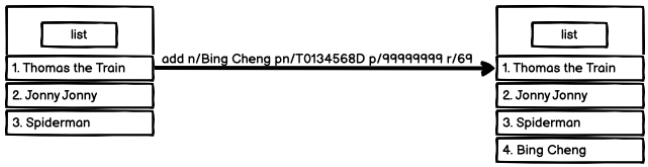
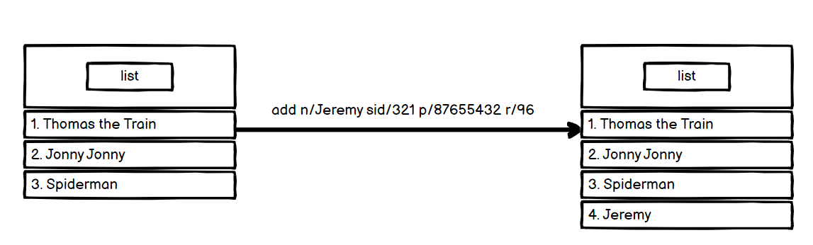
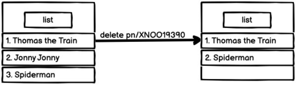
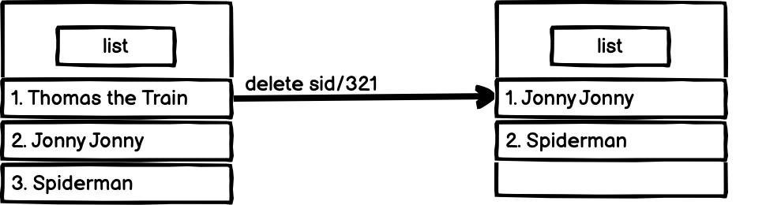

<h3><i>Welcome to the Pocket Hotel User Guide!</i></h3>

**Pocket Hotel (PH)** is a specialized contact management desktop app targeted towards hotel managers who have many
guests and staff to handle.

**PH** provides a centralized location to store, organize and manage information linked to your guests and staff
members. **PH**
streamlines your workflow and is optimized for use via the _Command Line Interface_ (**CLI**), whilst still embodying
the benefits of a _Graphical User Interface_ (**GUI**).

This user guide serves as an entry point for users to get oriented with how **PH** operates and how you may utilize it
fully to integrate it within your hotel management system.

--------------------------------------------------------------------------------------------------------------------

## **Table of Contents**

* Table of Contents 
{:toc}

--------------------------------------------------------------------------------------------------------------------

## **Quick start**

1. Ensure you have Java `11` or above installed in your Computer.

2. Download the latest `PH.jar` from [here](https://github.com/AY2122S1-CS2103T-W12-3/tp/releases).

3. Copy the file to the folder you want to use as the _home folder_ for **PH**.

4. To start the application, you may either:
    1. Double-click the `PH.jar` file to boot up the app.
    2. Open up your shell terminal in the directory where **PH** resides, and run the command `java -jar PH.jar`.

The **GUI** similar to the below should appear in a few seconds. Note how the app contains some sample data.

<i>Figure 1. Pocket Hotel GUI</i>

5. Type any command in the command box and press Enter to execute it. e.g. typing **`help`** and pressing Enter will
   open the help window. 
   Some example commands you can try:

    * **`list`** : Lists all contacts.

    * **`add`**`n/John Doe pn/X12345678F r/123 e/johnd@example.com a/John street, block 123, #01-01` : Adds a guest
      named `John Doe` to the Address Book.

    * **`delete`**`pn/X12345678F` : Deletes the guest with passport number X12345678F.

    * **`clear`** : Clears all contacts. 

    * **`exit`** : Exits the app.
    
You may refer to the [Features](#features) below for details of each command and to get familiarized with the syntax of 
the commands.

--------------------------------------------------------------------------------------------------------------------

## **Features**

**PH**’s features revolve around managing your guests and staff. For each command, a short description of its use is
given which is then followed by the format and a short example to help ensure that you have executed the command
correctly.

A quick overview of all the commands can be found in the [command summary.](#command-summary)

Certain commands require parameters, which may have certain constraints. A quick overview of all the underlying
constraints can be found in the [parameter constraints.](#parameter-constraints-summary)

**:information_source: Notes about the command format:** 

* Words in `UPPER_CASE` are the parameters to be entered by the user. 
  e.g. in `add n/NAME`, `NAME` is a parameter which can be used as `add n/John Doe`.

* Parameter prefixes such as `n/` and `pn/` are special keywords that indicate a start of a parameter.

* Fields with square brackets are optional. 
  e.g `n/NAME [p/PHONE_NUMBER]` can be used as `n/Bing Cheng p/99999999` or as `n/Bing Cheng`.

* Parameters can be in any order. 
  e.g. if the command specifies `n/NAME pn/PASSPORT_NUMBER`, `pn/PASSPORT_NUMBER n/NAME` is also acceptable.

* If a parameter is expected only once in the command but you specified it multiple times, only the last occurrence of
  the parameter will be taken. 
  e.g. if you specify `p/12341234 p/56785678`, only `p/56785678` will be taken.

* Extraneous parameters for commands that do not take in parameters (such as `help`, `list`, `exit`) will be
  ignored. 
  e.g. if the command specifies `help 123`, it will be interpreted as `help`.

### Adding guests/staff : `add`

Adds a new **guest** or **staff** and their contact details into **PH**. Each entity has their own unique fields.

Format:
 Guest: `add pn/<PASSPORT_NUMBER> n/<NAME> e/EMAIL r/<ROOM_NUMBER> [t/TAG]`
 Staff: `add sid/<STAFF_ID> n/<NAME> e/<EMAIL> p/<PHONE_NUMBER> a/<ADDRESS> [t/<TAG>]`

Example 1 (Add guest):
 

* `list` command lists all contact details of people in the address book.
* `add n/Bing Cheng pn/T0134568D p/99999999 r/69` , adds a new guest, Bing Cheng to **PH** and shows the new contact
  list.

Example 2 (Add staff):
 

* `list` command lists all contact details of people in the address book.
* `add n/Jeremy sid/321 p/87655432` , adds a new staff, Jeremy to **PH** and shows the new contact list.

[Back to Table of Contents](#table-of-contents)

### Editing fields of guests/staff: `edit`

Edit a **guest** or **staff’s** contact details by their unique identifier (Guest are identified by their `PASSPORT_NUMBER` 
and Staff are identified by their `STAFF_ID`). Only edits the fields that have been passed in as parameters. 

Format:
 Guest: `edit pn/<PASSPORT_NUMBER> <FIELD_NAME>/<NEW_FIELD_DETAILS>`
 Staff: `edit sid/<STAFF_ID> <FIELD_NAME>/<NEW_FIELD_DETAILS>`

* Existing values will be updated to the input values.
* You can edit more than one field at a time (See example below).
* Note that when changing a guest of staff unique identifier, it is important that there is no pre-existing staff or 
guest with that unique identifer already.

Example 1 (Edit guest):

* `edit pn/X12345678A r/123` locates the guest Bing Cheng, by his passport number X12345678A and overwrites the
   room number field with the new room number provided.

Example 2 (Edit staff):

* `edit sid/123 p/99999999 e/j@mailer.com` locates the staff Jeremy, by his staff ID, 123 and overwrites the phone number
   field with the new phone number provided, and the email field with the new email provided.

[Back to Table of Contents](#table-of-contents)

### Deleting guests/staff: `delete`

Deletes an existing **guest** or **staff** using their unique identifier (`PASSPORT_NUMBER` and `STAFF_ID` respectively).

Format:
 Guest: `delete pn/<PASSPORT_NUMBER>`
 Staff: `delete sid/<STAFF_ID>`

Example 1 (Delete guest):
 

* `delete pn/XNOO19390 (PASSPORT_NUMBER)`, The guest, Jonny Jonny who has passport number XNOO19390, is deleted from **
  PH**.

Example 2 (Delete staff):
 

* `delete sid/321`, The staff, Thomas The Train, who has the staff ID 321, is deleted from **PH**.

[Back to Table of Contents](#table-of-contents)

### List all guests/staff: `list`

Shows a list of all people (**staff** and **guests**) found in **PH**.

* Contacts are not arranged in any particular order e.g staff contacts followed by guest contacts
* After a filter or view, this command may come in handy when you wish to view back the whole list.

Format: `list`

[Back to Table of Contents](#table-of-contents)

### Viewing a particular guest/guest: `view`

Views the **staff** or **guest** by their unique identifier, `STAFF_ID` or `PASSPORT_NUMBER`. All the details associated with 
the staff/guest will be shown in the **GUI**.

Format:
 Guest: `view pn/<PASSPORT_NUMBER>`
 Staff: `view sid/<STAFF_ID>`

Example 1 (View Guest):
* `view pn/X12345678A` shows the details of the guest associated with the given passport number.

Example 2 (View Staff):
* `view sid/123` shows the details of the staff associated with the given staff ID.

[Back to Table of Contents](#table-of-contents)

### Exiting the program: `exit`

Exits the program.

Format: `exit`

[Back to Table of Contents](#table-of-contents)

### Clearing all entries: `clear`

Clears all entries from PH.

Format: `clear`

[Back to Table of Contents](#table-of-contents)

### Viewing help: `help`

Shows a message explaining how to access the help page.

Format: `help`

[Back to Table of Contents](#table-of-contents)

### Saving your Data

Your data is saved automatically to the hard disk after every command you enter. The file is saved in `.json` format,
which allows you to edit the file manually without even booting up **PH**.

[Back to Table of Contents](#table-of-contents)

### Editing your data directly

Here’s a snippet of the editable text file in JSON that is found at:
`[JAR file location]/data/addressbook.json`

:exclamation: **Caution:**
Editing the json file directly should only be done by a user experienced with .json format files.

[Back to Table of Contents](#table-of-contents)

### Archiving data files `[coming in v2.0]`

_Details coming soon ..._

--------------------------------------------------------------------------------------------------------------------

## **Command Summary**

Action | Format, Examples
--------|------------------
**Add** | Guest: `add pn/<PASSPORT_NUMBER> n/<NAME> e/EMAIL r/<ROOM_NUMBER> [t/TAG]` Staff: `add sid/<STAFF_ID> n/<NAME> e/<EMAIL> p/<PHONE_NUMBER> a/<ADDRESS> [t/<TAG>]`  Examples: `add pn/T0134568D n/Bing Cheng e/bingcheng@email.com r/101`  `add sid/321 n/Jeremy e/jeremy@email.com p/87655432 a/Downing Street`
**Edit** | Guest: `edit pn/<PASSPORT_NUMBER> <FIELD_NAME>/<NEW_FIELD_DETAILS>` Staff:`edit sid/<STAFF_ID> <FIELD_NAME>/<NEW_FIELD_DETAILS>`  Examples: `edit pn/X12345678A p/99999999` `edit sid/S12345678A p/99999999`
**Delete** | Guest: `delete pn/<PASSPORT_NUMBER>` Staff: `delete sid/<STAFF_ID>`  Examples: `delete pn/XNOO19390` `delete sid/321`
**List** | `list`
**View** | Guest: `view pn/<PASSPORT_NUMBER>` Staff: `view sid/<STAFF_ID>`  Examples: `view pn/X12345678A` `view sid/123`
**Clear** | `clear`
**Help** | `Help`
**Exit** | `exit`

[Back to Table of Contents](#table-of-contents)

--------------------------------------------------------------------------------------------------------------------

## **Guest Parameter Constraints Summary**

Parameter | Prefix | Constraints, Examples
----------|--------|-----------------------
**PASSPORT_NUMBER** | `pn/` | Blank inputs are not allowed  Example: `pn/X12345678A`
**NAME** | `n/` | Blank inputs are not allowed, and should only contain alphabetical characters.   Example: `n/Bing Cheng`
**EMAIL** | `e/` | Blanks inputs are not allowed, a valid email address should be used. Example: `e/BingCheng@email.com`
**ROOM_NUMBER** | `r/` | Blank inputs are not allowed, only numbers greater than 0 are valid. Example: `r/500`
**TAG** | `t/` | Optional field. Example: `t/Vaccinated`

## **Staff Parameter Constraints Summary**

Parameter | Prefix | Constraints, Examples
----------|--------|-----------------------
**STAFF_ID** | `sid/` |  Blank inputs are not allowed, not allowed to be used with `pn/` e.g., `sid/2131`
**NAME** | `n/` | Blank inputs are not allowed, and should only contain alphabetical characters.   e.g., `n/Bing Cheng`
**EMAIL** | `e/` | Blanks inputs are not allowed, a valid email address should be used. e.g., `e/BingCheng@email.com`
**PHONE_NUMBER** | `p/` | Local phone numbers are 8 digits long, and should start with 8 or 9.   e.g., `p/99999999`
**ADDRESS** | `a/` | Blank inputs are not allowed.
**TAG** | `t/` | Optional field.

[Back to Table of Contents](#table-of-contents)

--------------------------------------------------------------------------------------------------------------------

## **Glossary**

* **PH**: Acronym for Pocket Hotel
* **CLI**: Command line interface
* **GUI**: Graphical user interface
* **Guest**: A guest at the hotel
* **Staff**: An employee of the hotel

[Back to Table of Contents](#table-of-contents)

--------------------------------------------------------------------------------------------------------------------

## **FAQ**

**Q**: How do I transfer my data to another Computer? 
**A**: Install the app on your other computer and run it. Overwrite the empty .json file that is created with your old
.json file in your old computer. 

**Q**: How do I know if Java 11 is installed correctly on my computer? 
**A**: Open up your terminal and run `java --version`. The output should be java 11, if installed correctly. 

[Back to Table of Contents](#table-of-contents)

--------------------------------------------------------------------------------------------------------------------

