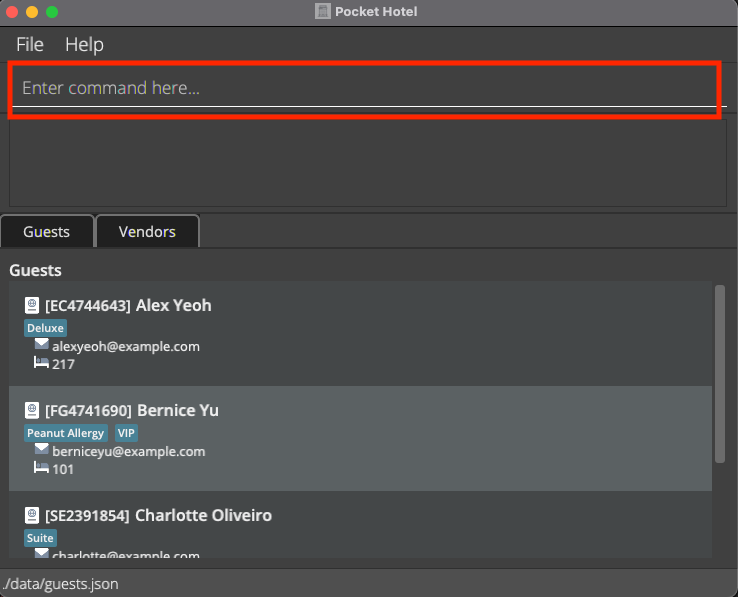
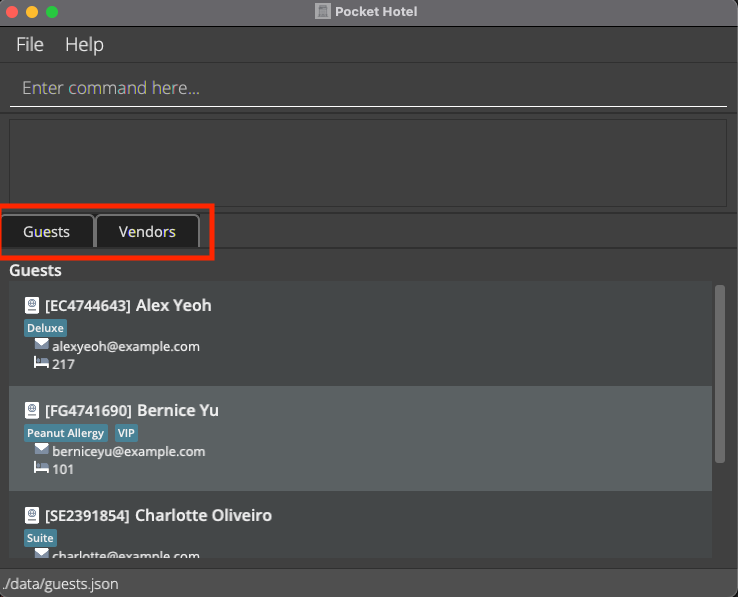
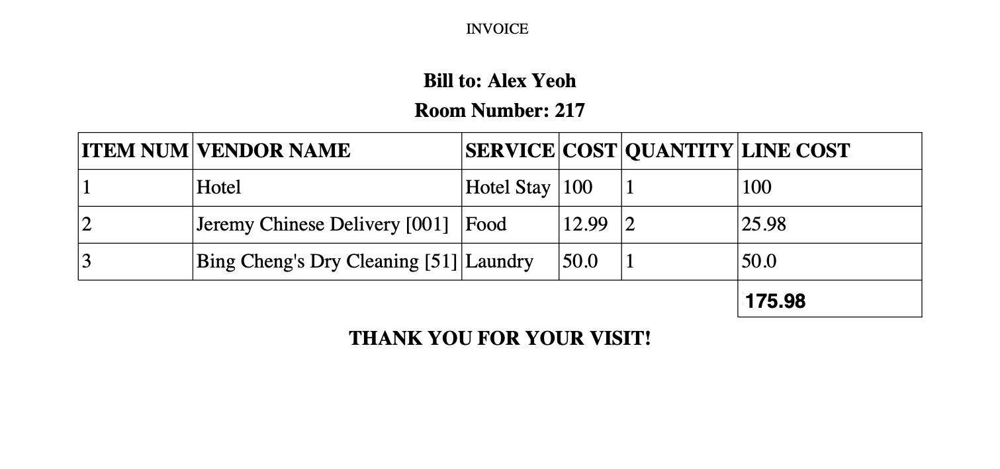
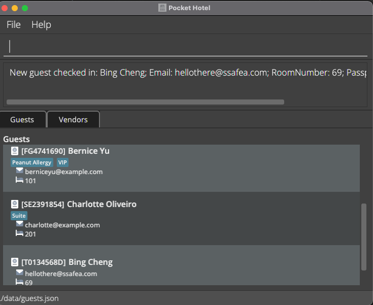
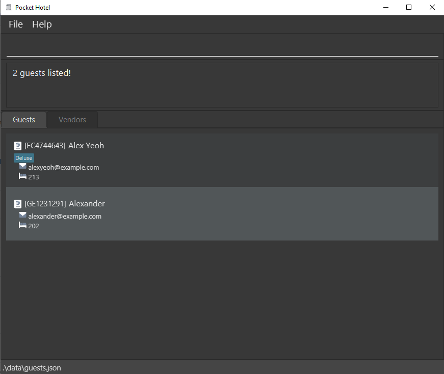
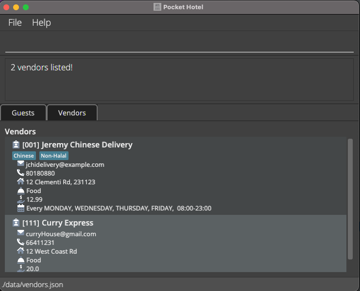
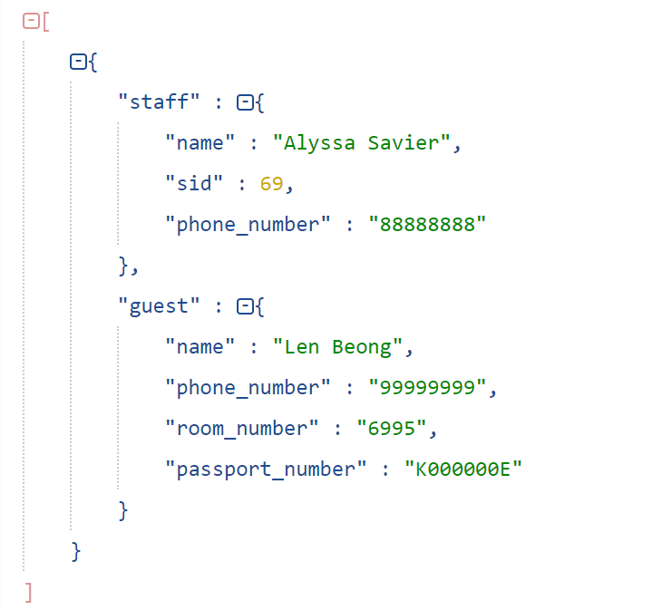

<h3><i>Welcome to the Pocket Hotel User Guide!</i></h3>

**Pocket Hotel (PH)** is a specialized contact management desktop app targeted towards hotel front office staff such as front desk staff who
frequently interact with guests.

**PH** provides a centralized location to store, organize and manage information linked to your guests and vendors employed by the hotel. **PH**
streamlines your workflow and is optimized for use via the _Command Line Interface_ (**CLI**), whilst still embodying
the benefits of a _Graphical User Interface_ (**GUI**). This means that faster typists would have the benefit of carrying out actions faster using our
_Command Line Interface_(**CLI**) than through the _Graphical User Interface_ (**GUI**) using actions such as mouse clicks.
This user guide serves as an entry point for users to get oriented with how **PH** operates and how you may utilize it
fully to integrate it within your hotel management system.

Do not worry if this is your first time using a _CLI_ application, jump to our [Using this Guide](#using-this-guide) section to learn more about how
you are able to use this guide as we intended and become a master in using our application!

--------------------------------------------------------------------------------------------------------------------

# **Table of Contents**
* Table of Contents
{:toc}

--------------------------------------------------------------------------------------------------------------------
# **Using this Guide**

Before you start, we would like to help orientate you to some symbols and text markups that you
will frequently encounter throughout this guide. 

**:information_source: This is a note:** 
* Notes will be useful in providing additional information of a certain feature or section. 

:exclamation: **Caution:**
This is a caution.
Do look out for these! They warn you about any possible risks or dangers of a given action.

Markup | Meaning 
-------|------------------
[Click me!](#using-this-guide) | These are hyperlinks, that are meant to provide you an easier time navigating this guide.
**PH** | Denotes glossary terms. These are words that may be confusing or too technical to you. You may refer to the [glossary](#glossary) if lost.
`help` | Denotes the commands and parameters used in the application.

[Back to Table of Contents](#table-of-contents)

# **Quick start**
1. Ensure you have Java `11` or above installed in your Computer ([Instructions on how to check Java version](#faq)).
   1. If you do not have Java `11` installed on your computer. ([Instructions on how to install Java 11](#faq)).
2. Download the latest `PH.jar` from [here](https://github.com/AY2122S1-CS2103T-W12-3/tp/releases).

3. Copy the file to the folder you want to use as the _home folder_ for **PH**.

4. To start the application, you may either:
   1. Double-click the `PH.jar` file to boot up the app.
   2. Open up your _shell terminal_ in the directory where **PH** resides, and run the command `java -jar PH.jar`.
   (You may follow these guides for [Mac](https://www.macworld.com/article/221277/command-line-navigating-files-folders-mac-terminal.html) or [Windows](https://www.howtogeek.com/659411/how-to-change-directories-in-command-prompt-on-windows-10/))
      The **GUI** similar to the picture below, should appear in a few seconds. Note how the app contains some sample data.

:exclamation: **Caution:**
For Mac users, method 2 is the recommended way to open your files to ensure that you are able to see the save data for **PH**

<i>Figure 1. Pocket Hotel GUI</i>

5. Type any command in the command box _(Highlighted in red above)_ and press Enter to execute it. e.g. typing `help` and pressing Enter will
   open the help window. Click the tab for the list that you would like to view e.g click vendor to view vendors in stored in **PH** 
   Some example commands you can try:

    * **`checkin`**`n/John Doe pn/X12345678F r/123 e/johnd@example.com t/Senior Citizen` : Adds a guest
      named `John Doe` to the address book.

    * **`deleteguest`**`pn/X12345678F` : Deletes the guest with passport number X12345678F.

    * **`addvendor`**`vid/123 n/Wang's Satay e/satayMan@email.com p/84711231 a/Geylang Street 31 sn/Satay c/5 oh/1 0800-2000` : Adds a vendor
        named `Wang's Satay` to the address book.

    * **`deletevendor`**`vid/123` : Deletes the vendor with vendor id 123.

    * **`exit`** : Exits the app.

You may refer to the [features](#features) below for details of each command and to get familiarized with the syntax of
the commands.

[Back to Table of Contents](#table-of-contents)

--------------------------------------------------------------------------------------------------------------------

# **Features**

**PH**’s features revolve around managing your **guests** and **vendors**. For each command, a short description of its use is
given which is then followed by the format and a short example to help ensure that you have executed the command
correctly.

A quick overview of all the commands can be found in the [command summary](#command-summary).

Certain commands require parameters, which may have constraints. A quick overview of all the underlying
constraints can be found in the [parameter constraints.](#parameter-constraints-section)

**:information_source: Notes about the command format:** 

* Words in `UPPER_CASE` are the parameters to be entered by the user. 
  e.g. in `checkin n/NAME`, `NAME` is a parameter which can be used as `checkin n/John Doe`.

* Parameter prefixes such as `n/` and `pn/` are special keywords that indicate a start of a parameter.

* Fields with square brackets are optional. 
  e.g `n/NAME [t/TAG]` can be used as `n/Bing Cheng t/VIP` or as `n/Bing Cheng`.

* Parameters can be in any order. 
  e.g. if the command specifies `n/NAME pn/PASSPORT_NUMBER`, `pn/PASSPORT_NUMBER n/NAME` is also acceptable.

* If a parameter is expected only once in the command but you specified it multiple times, only the last occurrence of
  the parameter will be taken. 
  e.g. if you specify `p/12341234 p/56785678`, only `p/56785678` will be taken.

* Extraneous parameters for commands that do not take in parameters (such as `help`, `list`, `exit`) will be
  ignored. 
  e.g. if the command specifies `help 123`, it will be interpreted as `help`.
* All fields cannot be empty
* The tag field is optional and can be omitted entirely (You can learn more about tags [here](#Tagging-a-guest-or-vendor).)

[Back to Table of Contents](#table-of-contents)

--------------------------------------------------------------------------------------------------------------------

## Contacts in Pocket Hotel
There are 2 types of contacts in **PH**, **guests** and **vendors**. Guests represent guests of the hotel, and vendors represent external companies employed by a hotel for services. Guest are identified by their `PASSPORT_NUMBER`
and Vendors are identified by their `VENDOR_ID`. These fields are their **unique identifier**, and no two contacts can have the same unique identifier.

It is possible for **guests** and **vendors** to have the same **unique identifier** for example, `VENDOR_ID` of a vendor is 111 and `PASSPORT_NUMBER` for a guest is 111, as they represent 2 different entities.

Guests and vendors have different parameters, which can be found in the [parameter constraints table](#parameter-constraints-section) or in the command instructions.

## Navigating between guest and vendor list
You have 2 options to navigate between the **guest** and **vendor** list.

Either
1. Click the button on the **GUI** to view the different lists e.g To view the guest list click on the guest button.

2. Use the `listguest` or `listvendor` command to view the respective lists.

**:information_source: Notes about the command format:** 
* Regardless of the list currently being viewed, you are able to execute any command. e.g While viewing the guest list,
  you are able to add a vendor. Toggle back to the vendor list to see the reflected changes.

## Tagging a guest or vendor
We have implemented a tagging system that allows you to attach labels to **guests** or **vendors**. You are able to see the
tags attached to every guest or vendor, and the `filterguest` and `filtervendor` commands allows you to filter your lists
by fields or even tags! These tags can be used in _any way you like_. One idea is to
note down important details about guest such as adding a "vegetarian" tag to guests who are vegetarian or have other dietary
restrictions.

Every vendor and guest can have more than one tag attached to them, so you are free to integrate your existing system of organising guests or vendors
right into **PH**!

## Archiving guest information
Upon [checking out](#checking-out-a-guest-checkout) a **guest**, their contact is removed from the list, BUT their information is not deleted. It is instead moved
to an archive where the information is stored. This allows you to use the `returncheckin` command to check in the **guest** on their
subsequent visits and saves you the time of entering all their information again.

**:information_source: Notes:** 

* When a guest is in the archive, the `clearguest` and `deleteguest` commands are able to delete this guest.
* You are not able to edit a guest in the archive.

## Invoice Generation
Upon checking out a **guest**, a **PDF** invoice will be generated in a folder called `Invoices` in the directory that the `PH.jar` is found in. The invoice will be named in the format
`GUEST_NAME YYYY-MM-DD HH-MM-SS.pdf`, where the `YYYY-MM-DD HH-MM-SS` denotes the current year, month, data, hours, minutes and seconds, at the time the invoice was generated.

The invoice contains information such as the guest details and any services
that have been used during the guests stay (See [chargeguest](#charge-a-guest-for-a-service-chargeguest))

**:information_source: Notes:** 

* This time is based off the internal clock of your computer.

[Back to Table of Contents](#table-of-contents)

## Commands

### Manage Guests

#### Checking in a new guest: `checkin`

Checks in a new **guest** by adding their contact details into **PH**.

Format:
 `checkin pn/<PASSPORT_NUMBER> n/<NAME> e/<EMAIL> r/<ROOM_NUMBER> [t/<TAG>]`

Parameters:
* `NAME`: No constraints on name used. Cannot be left blank.
* `PASSPORT_NUMBER`: Should only contain alphanumeric characters.
* `EMAIL`: A valid email address should be used.
* `ROOM_NUMBER`: Only numbers greater than 0 are valid.
* `TAG`: An optional field, more than one can be included in the command.

Example:

* `checkin n/Bing Cheng pn/T0134568D e/bc@gmail.com r/69` , adds a new **guest**, Bing Cheng to **PH** and shows the new contact
  list.

[Back to Table of Contents](#table-of-contents)

#### Checking in a returning guest: `returncheckin`
Checks in a returning **guest** into **PH**, by retrieving their details from the archive and providing them a new room number to check into.

Format:
 `returncheckin pn/<PASSPORT_NUMBER> r/<ROOM_NUMBER>`

Parameters:
* `PASSPORT_NUMBER`: Should only contain alphanumeric characters.
* `ROOM_NUMBER`: Only numbers greater than 0 are valid.

**:information_source: What is the archive?** 

* Contains past records of guests who have stayed at the hotel
* Guest is added to the archive by performing the `checkout` command

[Back to Table of Contents](#table-of-contents)

#### Checking out a guest: `checkout`
Checks out a **guest** by archiving their details and generating an invoice for all the services hired by the **guest** during their stay.

Format:
 `checkout pn/<PASSPORT_NUMBER>`

Parameters:
* `PASSPORT_NUMBER`: Should only contain alphanumeric characters.

Example:

* `checkout pn/X12345678A` checks out the guest Bing Cheng, whose passport number is X12345678A.

**:information_source: What is the archive?** 

* Contains past records of guests who have stayed at the hotel
* Guest is added to the archive by performing the `checkout` command

[Back to Table of Contents](#table-of-contents)

#### Editing fields of a guest: `editguest`

Edits a **guest**'s contact details. Only edits the fields that have been passed in as parameters (See example for further
elaboration).

Format:

`editguest pn/<PASSPORT_NUMBER> [<FIELD_NAME>/<NEW_FIELD_DETAILS>]`

Parameters:

* `PASSPORT_NUMBER`: Should only contain alphanumeric characters.
* `NAME`: No constraints on name used. Cannot be left blank.
* `EMAIL`: A valid email address should be used.
* `ROOM_NUMBER`: Only numbers greater than 0 are valid.
* `TAG`: An optional field, more than one can be included in each command.

Example:
* `editguest pn/X12345678A r/123` locates the guest Bing Cheng, by his passport number X12345678A and overwrites the
  room number field with the new room number provided. All his other fields (**NAME**, **EMAIL**, **PASSPORT_NUMBER**, **TAG**)
  will remain unchanged.

* `editguest pn/X87654321A t/VIP t/LoyalGuest e/jj@mailer.com` locates the guest Jeremy, by his passport number X87654321A and overwrites his existing tags with the new tags provided,
  and overwrites the old email field with the new email provided. All his other fields (**NAME**, **PASSPORT_NUMBER**, **ROOM_NUMBER**) will remain unchanged.

**:information_source: Notes:** 

* Existing field values will be overwritten by the newly provided field values.

* The passport number must be provided, as it is used to identify which guest to be edited.

* You need to specify at least one field to edit.

* You can edit more than one field at a time (See example above).

* You cannot edit a guest's passport number.

[Back to Table of Contents](#table-of-contents)

#### Deleting a guest's details: `deleteguest`

Deletes an existing **guest**'s contact details from **PH**. Guests deleted can be checked in or in the archive.

Format:
 `deleteguest pn/<PASSPORT_NUMBER>`

Example:
`deleteguest pn/XNOO19390` deletes the guest who has passport number XNOO19390 from **PH**.

[Back to Table of Contents](#table-of-contents)

#### Clear all checked in guests: `clearguest`

Deletes all **guests** that are currently checked in.

Format:
 `clearguest`

:exclamation: **Caution:**
The `clearguest` command would remove all guests and is irreversible.
Only use this command if you are absolutely you need to wipe all guest data.

**:information_source: Note:** 
* **Archived guests** are not deleted.

[Back to Table of Contents](#table-of-contents)

#### Show all guests: `listguest`

Shows all the **guests** checked into the hotel. Useful command to use after `filterguest`,
it essentially removes any filter that was previously applied to the guest list.

Format:
 `listguest`

**:information_source: Notes:** 
* Guests are not arranged in any particular order 
* Running the command when you are on the vendor list, will switch to the guest list for you.

[Back to Table of Contents](#table-of-contents)

#### Charge a guest for a service: `chargeguest`

Charges a **guest** for a service offered by a vendor, and adds it to the invoice that will be generated upon checkout.

Format:
 `chargeguest pn/<PASSPORT_NUMBER> vid/<VENDOR_ID>`

Parameters:
* `PASSPORT_NUMBER`: Should only contain alphanumeric characters.
* `VENDOR_ID`: Should only contain alphanumeric characters.
  * The `VENDOR_ID` must be from one of the existing vendors in the **PH**

Example:
* `chargeguest pn/T0134568D vid/001` , Charge the guest with passport number `T0134568D` with the service
provided by the vendor with the vendor id of `001`.

[Back to Table of Contents](#table-of-contents)

#### Filter guest list: `filterguest`

Displays only the **guests** that meet your requirements, as specified by what you wrote in your filter. This helps you
easily find and search through _smaller and more manageable lists_, instead of scrolling through the entire guest list.

Format:
`filterguest [<FILTER_FIELD_NAME>/<FILTER_FIELD_VALUE>]`

Parameters:
* `PASSPORT_NUMBER`: Should only contain alphanumeric characters.
  * The passport number specified by you must _match the guest passport's number exactly_ to be filtered. 
  * E.g. a guest with a `PASSPORT_NUMBER` of `SE1239182` will not be shown in your **GUI** if you run the command `filterguest pn/SE123`
* `NAME`: No constraints on name used.
  * The name specified by you simply needs to _match the guest's name partially_ to be filtered. 
  * E.g. a guest with a `NAME` of `Jeremy Tan` will be shown in the **GUI** if you run the command `filterguest n/jeremy` or `filterguest n/remy`
    * However, running the command `filterguest n/tan jeremy` will not filter the guest.
* `EMAIL`: A valid email address should be used.
  * The email specified by you simply needs to _match the guest's email partially_ to be filtered.
  * E.g. a guest with a `EMAIL` of `jeremytan@example.com` will be shown in the **GUI** if you run the command `filterguest e/tan`
* `ROOM_NUMBER`: Only numbers greater than 0 are valid.
  * The room number specified by you needs to _match with the guest's room number partially_ to be filtered, however the _order is important_, unlike `EMAIL` and `NAME`.
  * E.g. a guest with a `ROOM_NUMBER` of `201` will be shown in the **GUI** if you run the command `filterguest r/2`
    * However, the guest will not be filtered if you run the command `filterguest r/1`. The reason for this is that hotels
    generally have room numbers with its starting number as the floor level. Such as all hotel rooms on level 1, will
    have their room number starting with 1.
    * We felt that this would provide you a more _useful filter_, as running `filterguest r/2` would filter all the guest
    with their room number starting with a 2, and in essence you would be filtering all the guests that are residing in
    the second floor of your hotel. This would mean guests with `ROOM_NUMBER` that do not start with `2` but may have `2`
    in their `ROOM_NUMBER` are not filtered. An example being `102`.
* `TAG`: An optional field, more than one can be included in the command.
  * The tags specified by you need to _match the guest's tags exactly_ to be filtered.
  * E.g. guests with a `TAG` of `VIP` and guests with a `TAG` of `Deluxe` will be filtered if you run the command `filterguest t/vip t/deluxe`
    * Note that guest with either one of the tags gets filtered, they do not have to both tags to get filtered. The same logic applies when more than two tags are supplied by you.

Example: 

`filterguest n/alex r/2`, guests with a `NAME` that contains Alex and have a `ROOM_NUMBER` starting with 2, will be filtered from **PH**.

**:information_source: Note:** 
* Running the `filterguest` command always applies the filter to all your guests in **PH** and not to an already filtered guest list.
* All fields are case-insensitive.

[Back to Table of Contents](#table-of-contents)

### Manage Vendors

#### Adding a vendor: `addvendor`

Adds a **vendors** details to **PH**

Format:
 `addvendor vid/<VENDOR_ID> n/<NAME> e/<EMAIL> p/<PHONE_NUMBER> a/<ADDRESS> sn/<SERVICE_NAME> c/<SERVICE_COST> oh/<OPERATING HOURS> [t/TAG]`

Parameters:
* `VENDOR_ID`: Should only contain alphanumeric characters
* `NAME`: No constraints on name used. Cannot be left blank.
* `EMAIL`: A valid email address should be used.
* `ADDRESS`: Blank inputs are not allowed.
* `PHONE_NUMBER`: At least 3 digits long, should only contain numbers.
* `SERVICE_NAME`: Alphabetical characters and spaces are allowed.
* `SERVICE_COST`: Number greater than 0, will be rounded to 2 decimal places.
* `OPERATING_HOURS`: Duplicates are allowed. Please refer to the note below for more details.
* `TAG`: An optional field, more than one can be included in each command.

Example:
 `addvendor vid/123 n/Wang's Satay e/satayMan@email.com p/84711231 a/Geylang Street 31 sn/Satay c/5 oh/1 0800-2000`

**:information_source: Note on OPERATING_HOUR format:** 
Format:
 `DAYS STARTTIME-ENDTIME`
 Monday is represented using a 1 and Sunday is represented by 7. Example: `1234567 0800-2359`: Monday to Sunday 8am to 11:59pm `1321 0800-0900`: Monday to Wednesday 7am to 9am

[Back to Table of Contents](#table-of-contents)

#### Editing fields of a vendor: `editvendor`

Edit a **vendors**' contact details. Only edits the fields that have been passed in as parameters. (See example for further elaboration).

Format:
 `editvendor vid/<VENDOR_ID> [<FIELD_NAME>/<NEW_FIELD_DETAILS>]`

Parameters:
* `VENDOR_ID`: Should only contain alphanumeric characters.
* `NAME`: No constraints on name used. Cannot be left blank.
* `EMAIL`: Blanks inputs are not allowed. A valid email address should be used.
* `PHONE_NUMBER`: At least 3 digits long, should only contain numbers.
* `ADDRESS`: Blank inputs are not allowed.
* `SERVICE_NAME`: Alphabetical characters and spaces are allowed.
* `SERVICE_COST`: Number greater than 0, will be rounded to 2 decimal places.
* `OPERATING_HOURS`: Duplicates are allowed.  Format: `DAYS STARTTIME-ENDTIME` Monday is represented using a 1 and Sunday is represented by 7. Example: `1234567 0800-2359`: Monday to Sunday 8am to 11:59pm `1321 0800-0900`: Monday to Wednesday 7am to 9am
* `TAG`: An optional field, more than one can be included in each command.

Example:
 `editvendor vid/123 p/99999999 e/j@mailer.com` locates the vendor, Wang's Satay, with `VENDOR_ID` 123 and overwrites the phone number
field with the new phone number provided, and the email field with the new email provided. All other fields of the vendor
(**VENDOR_ID**, **NAME**, **ADDRESS**, **SERVICE_NAME**, **SERVICE_COST**, **OPERATING_HOURS**, **TAG**) remain unchanged.

**:information_source: Notes:** 

* Existing field values will be overwritten by the newly provided field values.

* The vendor id must be provided, as it is used to identify which vendor to be edited.

* You need to specify at least one field to edit.

* You can edit more than one field at a time (See example above).

[Back to Table of Contents](#table-of-contents)

#### Deleting a vendor's details: `deletevendor`

Deletes a **vendors** contact details from **PH**.

Format:
 `deletevendor vid/<VENDOR_ID>`

Example:
 `deletevendor vid/321`  deletes the vendor with `VENDOR_ID` 321 from **PH**.

[Back to Table of Contents](#table-of-contents)

#### Clear vendor list : `clearvendor`

Deletes all **vendors** that are currently in **PH**.

Format:
 `clearvendor`

:exclamation: **Caution:**
The `clearvendor` command would remove all vendors and is irreversible.
Only use this command if you absolutely sure you need to wipe all vendor data.

[Back to Table of Contents](#table-of-contents)

#### Show all vendors: `listvendor`

Shows all the **vendors** added by you that offers services to your hotel. Useful command to use after `filtervendor`,
it essentially removes any filter that was previously applied to the vendor list.

Format:
 `listvendor`

**:information_source: Notes:** 
* Vendors are not arranged in any particular order 
* Running the command when you are on the guest list, will switch to the vendor list for you.

[Back to Table of Contents](#table-of-contents)

#### Filter vendor list: `filtervendor`

Displays only the **vendors** that meet your requirements, as specified by what you wrote in your filter. This helps you
easily find and search through _smaller and more manageable lists_, instead of scrolling through the entire vendor list.

Format: `filtervendor <FILTER_FIELD_NAME>/<FILTER_FIELD_VALUE>`

Parameters:
* `VENDOR_ID`: Should only contain alphanumeric characters
  * The vendor id specified by you must _match the vendor's vendor id exactly_ to be filtered.
  * E.g. a vendor with a `VENDOR_ID` of `001` will not be shown in your **GUI** if you run the command `filtervendor vid/1`
* `NAME`: No constraints on name used. Cannot be left blank.
  * The name specified by you simply needs to _match the vendor's name partially_ to be filtered.
  * E.g. a vendor with a `NAME` of `Jeremy's Massage Parlour` will be shown in the **GUI** if you run the command `filtervendor n/jeremy` or `filtervendor n/remy`
    * However, running the command `filtervendor n/parlour massage` will not filter the vendor.
* `EMAIL`: A valid email address should be used.
  * The email specified by you simply needs to _match the vendor's email partially_ to be filtered.
  * E.g. a vendor with a `EMAIL` of `jmassage@example.com` will be shown in the **GUI** if you run the command `filtervendor e/massage`
* `ADDRESS`: Blank inputs are not allowed.
  * The address specified by you simply needs to _match the vendor's address partially_ to be filtered.
  * E.g. a vendor with a `ADDRESS` of `123 Clementi Rd` will be shown in the **GUI** if you run the command `filtervendor a/clementi`
* `PHONE_NUMBER`: At least 3 digits long, should only contain numbers.
  * The phone number specified by you needs to _match with the vendor's phone number partially_ to be filtered, however the _order is important_, unlike `EMAIL` and `NAME`.
  * E.g. a vendor with a `PHONE_NUMBER` of `93810282` will be shown in the **GUI** if you run the command `filtervendor p/938`
    * However, the vendor will not be filtered if you run the command `filtervendor p/8102`.
    * The phone number that you enter into the command will only filter the vendors with phone numbers that start with what you specified in the filter.
* `SERVICE_NAME`: Alphabetical characters and spaces are allowed.
  * The service name specified by you needs to _match the vendor's service name exactly_ to be filtered.
  * E.g. vendors with a `SERVICE_NAME` of `Massage` will be shown in the **GUI** if you run the command `filtervendor sn/massage`
    * However, the vendor will not be filtered if you run the command `filtervendor sn/mass`
* `SERVICE_COST`: Number greater than 0.
  * You may filter vendors by the _exact cost or a range (using "<" or ">")_.
  * E.g. vendors with a `SERVICE_COST` greater than 10 will be shown in the **GUI** if you run the command `filtervendor c/>10`
  * E.g. vendors with a `SERVICE_COST` of exactly 10 will be shown in the **GUI** if you run the command `filtervendor c/10`
* `OPERATING_HOURS`: Specified in this format `DAYS STARTTIME-ENDTIME`, Timings are in 24 hr format and days are represented using numbers, where 1 represents a Monday, and a 7 represents a Sunday.
  * You may filter vendors that operate _on certain days, certain days and a specified time, certain days and a specified time period, and those that are currently operating_.
  * E.g. vendors with `OPERATING_HOURS` on Monday and Wednesday will be shown in the **GUI** if you run the command `filtervendor oh/13`
  * E.g. vendors with `OPERATING_HOURS` on Monday and operate on 0800 will be shown in the **GUI** if you run the command `filtervendor oh/1 0800`
  * E.g. vendors with `OPERATING_HOURS` on Tuesday and operate **anywhere** between 0800 and 1300 will be shown in the **GUI** if you run the command `filtervendor oh/2 0800-1300`
  * E.g. vendors with `OPERATING_HOURS` that are currently operating will be shown in the **GUI** if you run the command `filtervendor oh/now`
* `TAG`: An optional field, more than one can be included in the command.
  * The tags specified by you need to _match the vendor's tags exactly_ to be filtered.
  * E.g. vendors with a `TAG` of `Cheap` and vendors with a `TAG` of `Good Rating` will be filtered if you run the command `filtervendor t/cheap t/good rating`
    * Note that vendors with either one of the tags gets filtered, they do not have to both tags to get filtered. The same logic applies when more than two tags are supplied by you.

Example: 

`filtervendor sn/Food c/>10 oh/now`, vendors with the `SERVICE_NAME` food and provide the service at a `COST` greater
than 10 and have `OPERATING_HOURS` where they are currently operating now will be filtered from **PH**

**:information_source: Note:** 
* Running the `filtervendor` command always applies the filter to all your vendors in **PH** and not to an already filtered vendor list. 
* All fields are case-insensitive.

[Back to Table of Contents](#table-of-contents)

### Utility Commands

#### Viewing help: `help`

Shows a message explaining how to access the help page.

Format: `help`

[Back to Table of Contents](#table-of-contents)

#### Exiting the program: `exit`

Exits the program.

Format: `exit`

[Back to Table of Contents](#table-of-contents)

### Saving your Data

Your data is saved automatically to the hard disk after every command you enter. The file is saved in `.json` format,
which allows you to edit the file manually without even booting up **PH**.

[Back to Table of Contents](#table-of-contents)

#### Editing your data directly

The Json files storing **guest** and **vendor** data are found at:
`[JAR file location]/data/guest.json` & `[JAR file location]/data/vendor.json`

:exclamation: **Caution:**
Editing the json file directly should only be done by a user experienced with .json format files.
As failure to follow the correct formatting would result in a corrupted file and would be replace with an empty file.

[Back to Table of Contents](#table-of-contents)

#### Guest in archive data format

The Json files storing archive guest data are found at:
`[JAR file location]/data/archive.json`

**:information_source: Note:** 
* The archived guests would have the room number and services field emptied in the Json file.
 Archived guest are also not shown in the UI. The rationale for this is that a returning guest would provide
his/her details to the receptionist upon checking in to the hotel, hence there is no need for the receptionist to
refer to details of the archived guests in the UI.

[Back to Table of Contents](#table-of-contents)

--------------------------------------------------------------------------------------------------------------------

# **Command Summary**

## Guest Command Summary

Action | Format, Examples
-------|------------------
**checkin** | `checkin pn/<PASSPORT_NUMBER> n/<NAME> e/<EMAIL> r/<ROOM_NUMBER> [t/<TAG>]` Example: `checkin pn/T0134568D n/Bing Cheng e/bingcheng@email.com r/101 t/VIP`
**returncheckin** | `returncheckin pn/<PASSPORT_NUMBER> r/<ROOM_NUMBER>` Example: `returncheckin pn/T0134568D r/101`
**checkout** | `checkout pn/<PASSPORT_NUMBER>` Example: `checkout pn/T0134568D`
**editguest** | `editguest pn/<PASSPORT_NUMBER> <FIELD_NAME>/<NEW_FIELD_DETAILS>` Example: `editguest pn/X12345678A p/99999999`
**deleteguest** | `deleteguest pn/<PASSPORT_NUMBER>` Example: `deleteguest pn/T0134568D`
**clearguest** | `clearguest`
**listguest** | `listguest`
**filterguest** | `filterguest <FILTER_FIELD_NAME>/<FILTER_FIELD_VALUE>` Example: `filterguest n/Bing t/VIP`
**chargeguest** | `chargeguest pn/<PASSPORT_NUMBER> vid/<VENDOR_ID>` Example: `charge pn/T0134568D vid/3`

## Vendor Command Summary

Action | Format, Examples
-------|------------------
**addvendor** | `addvendor vid/<VENDOR_ID> n/<NAME> e/<EMAIL> p/<PHONE_NUMBER> a/<ADDRESS> sn/<SERVICE_NAME> c/<SERVICE_COST> oh/<OPERATING HOURS> [t/TAG]` Example: `addvendor vid/123 n/Wang's Satay e/satayMan@email.com p/84711231 a/Geylang Street 31 sn/Satay c/5 oh/1 0800-2000`
**editvendor** | `editvendor vid/<VENDOR_ID> <FIELD_NAME>/<NEW_FIELD_DETAILS>` Example: `editvendor vid/111 sn/Laundry`
**deletevendor** | `deletevendor vid/<VENDOR_ID>` Example: `deletevendor vid/112`
**clearvendor** | `clearvendor`
**listvendor** | `listvendor`
**filtervendor** | `filtervendor vid/<VENDOR_ID> <FILTER_FIELD_NAME>/<FILTER_FIELD_VALUE>` Example: `filtervendor sn/Food t/satay`

## Utility Command Summary

Action | Format, Examples
-------|------------------
**help** | `help`
**exit** | `exit`

[Back to Table of Contents](#table-of-contents)

--------------------------------------------------------------------------------------------------------------------
# **Parameter Constraints Section**

## **Guest Parameter Constraints Summary**

Parameter | Prefix | Constraints, Examples
----------|--------|-----------------------
**PASSPORT_NUMBER** | `pn/` | Blank inputs are not allowed. Should only contain alphanumeric characters. Example: `pn/X12345678A`
**NAME** | `n/` | Blank inputs are not allowed. Example: `n/Bing Cheng`
**EMAIL** | `e/` | Blanks inputs are not allowed. A valid email address should be used. Example: `e/BingCheng@email.com`
**ROOM_NUMBER** | `r/` | Blank inputs are not allowed. Only numbers greater than 0 are valid. Example: `r/500`
**TAG** | `t/` | Blank inputs are not allowed. An optional field, more than one can be included in each command. Example: `t/Vaccinated t/Vegetarian`

## **Vendor Parameter Constraints Summary**

Parameter | Prefix | Constraints, Examples
----------|--------|-----------------------
**VENDOR_ID** | `vid/` |  Blank inputs are not allowed. Should only contain alphanumeric characters. Example: `vid/2131`
**NAME** | `n/` | Blank inputs are not allowed. No other constraints. Example: `n/Wang's Satay`
**EMAIL** | `e/` | Blanks inputs are not allowed. A valid email address should be used. Example: `e/satayMan@email.com`
**PHONE_NUMBER** | `p/` | Blank inputs are not allowed. At least 3 digits long, should only contain numbers Example: `p/84711231`
**ADDRESS** | `a/` | Blank inputs are not allowed. Example: `a/Geylang Street 31`
**SERVICE_NAME** | `sn/` | Blank inputs are not allowed. Alphabetical characters and spaces are allowed. Example: `sn/Satay`
**SERVICE_COST** | `c/` | Blank inputs are not allowed. Number greater than 0, will be rounded to 2 decimal places. Example: `c/5`
**OPERATING_HOURS** | `oh/` | Blank inputs are not allowed. Duplicates are allowed. Format: `DAYS STARTTIME-ENDTIME` Monday is represented using a 1 and Sunday is represented by 7. Example: `1234567 0800-2359`: Monday to Sunday 8am to 11:59pm `1321 0800-0900`: Monday to Wednesday 7am to 9am
**TAG** | `t/` | Blank inputs are not allowed. An optional field, more than one can be included in each command. Example: `t/Halal t/Free flow`

[Back to Table of Contents](#table-of-contents)

--------------------------------------------------------------------------------------------------------------------

# **Glossary**

* **PH**: Acronym for Pocket Hotel
* **CLI**: Command line interface
* **GUI**: Graphical user interface
* **Guest**: A guest at the hotel
* **Vendor**: An external entity that a hotel uses for services
* **PDF**: A file format for electronic document exchange. Short for Portable Document Format. 
* **Unique Identifier**: An attribute that uniquely identifies a guest or vendor in the address book.
* **Archived Guests**: Guests that are not checked into the hotel and are not displayed, but whose details are stored in **PH**.
* **Unarchived guests**: Guests who are currently checked into **PH** and can be viewed in the list.

[Back to Table of Contents](#table-of-contents)

--------------------------------------------------------------------------------------------------------------------

# **FAQ**

**Q**: How do I transfer my data to another Computer? 
**A**: Install the app on your other computer and run it. Overwrite the empty .json file that is created with your old
.json file in your old computer. 

**Q**: How do I know if Java 11 is installed correctly on my computer? 
**A**: Open up your terminal and run `java --version`. The output should be java 11, if installed correctly. 

**Q**: How do I install Java 11 on my computer? 
**A**: Please proceed to the download page [here](https://www.oracle.com/sg/java/technologies/javase/jdk11-archive-downloads.html), and download the latest version according to your system's specifications. 

**Q**: Is an internet connection required to boot up **PH**? 
**A**: No, all functionality of **PH** can be used without an internet connection. 

**Q**: Can I contact my guests directly on **PH**? 
**A**: Unfortunately, this is currently not possible. However, do look out for future updates. 

[Back to Table of Contents](#table-of-contents)

--------------------------------------------------------------------------------------------------------------------
